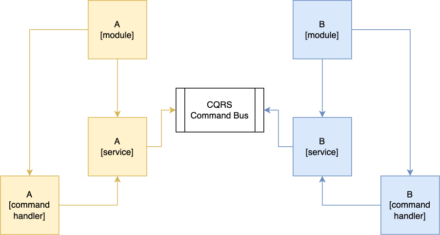

# Another to avoid circular dependencies in Nest.js
- [Nest.js circular dependencies](https://docs.nestjs.com/fundamentals/circular-dependency) might be avoided using ["Event Bus"](https://ducmanhphan.github.io/2020-06-06-Event-Bus-pattern/) pattern what removes direct module dependencies
- In this example the [@nest/cqrs](https://docs.nestjs.com/recipes/cqrs#cqrs) module used as Event Bus implementation
- 
## Father reads
- https://blog.logrocket.com/avoid-circular-dependencies-nestjs/
